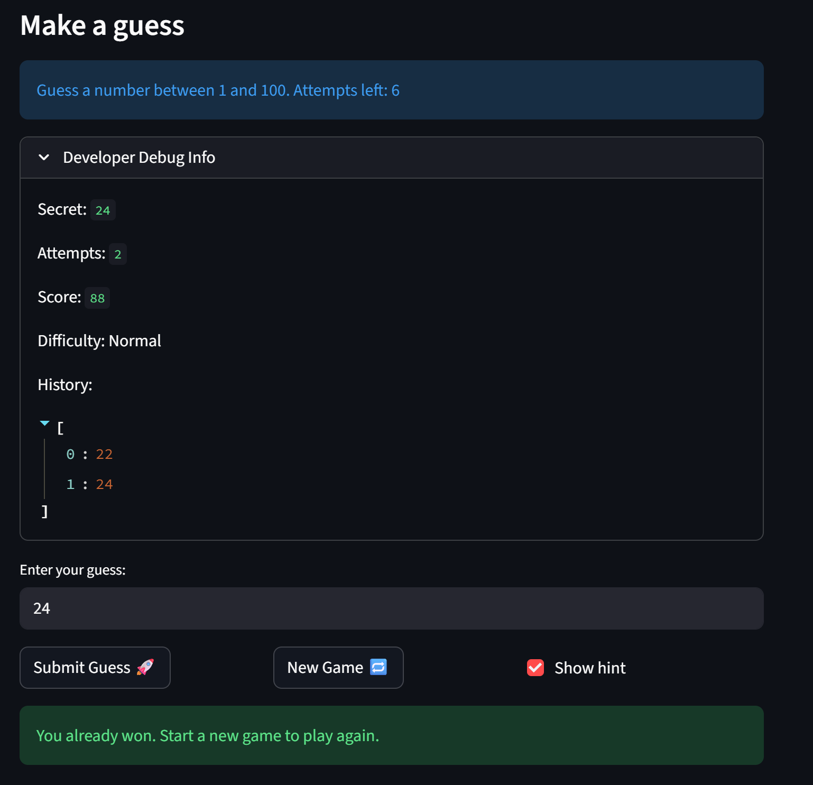

# 🎮 Game Glitch Investigator: The Impossible Guesser

## 🚨 The Situation

You asked an AI to build a simple "Number Guessing Game" using Streamlit.
It wrote the code, ran away, and now the game is unplayable. 

- You can't win.
- The hints lie to you.
- The secret number seems to have commitment issues.

## 🛠️ Setup

1. Install dependencies: `pip install -r requirements.txt`
2. Run the broken app: `python -m streamlit run app.py`

## 🕵️‍♂️ Your Mission

1. **Play the game.** Open the "Developer Debug Info" tab in the app to see the secret number. Try to win.
2. **Find the State Bug.** Why does the secret number change every time you click "Submit"? Ask ChatGPT: *"How do I keep a variable from resetting in Streamlit when I click a button?"*
3. **Fix the Logic.** The hints ("Higher/Lower") are wrong. Fix them.
4. **Refactor & Test.** - Move the logic into `logic_utils.py`.
   - Run `pytest` in your terminal.
   - Keep fixing until all tests pass!

## 📝 Document Your Experience

- [ The purpose of the game is to guess the right number within a certain amount of tries.] Describe the game's purpose.
- [The score bug, the "higher and lower bug" and the "new game" button bug". ] Detail which bugs you found.
- [fix: resolve hint direction, new game reset, and scoring bugs

- Move get_range_for_difficulty, parse_guess, check_guess, and
  update_score out of app.py and into logic_utils.py
- Add import statement in app.py to pull all functions from logic_utils
- Fix check_guess() returning reversed hint messages (Too High now says
  Go LOWER, Too Low now says Go HIGHER) in both try and except blocks
- Fix new game reset not restoring status to "playing", causing game to
  stay blocked after restart
- Fix new game reset using hardcoded randint(1, 100) instead of
  respecting difficulty range (low, high)
- Fix attempts initializing at 1 instead of 0, causing off-by-one in
  attempt tracking
- Replace broken scoring formula (100 - 10 * attempt) with linear
  formula (100 * (limit - attempt + 1) / limit) to match expected output
- Add attempt_limit parameter to update_score() and pass it from app.py
- Floor score at 0 to prevent negative scores on wrong guesses ] 
Explain what fixes you applied.

## 📸 Demo

- [ ] [Insert a screenshot of your fixed, winning game here]

## 🚀 Stretch Features

- [ ] [If you choose to complete Challenge 4, insert a screenshot of your Enhanced Game UI here]
